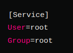

# Open5gs-tls

Do everything as given in the [tutorial](https://open5gs.org/open5gs/docs/guide/01-quickstart/)

For TLS feature to be implemented:

* scheme in the yaml should be selected as https
* Instead of `ip`, use FQDN. For eg: `amf.localdomain` for `https`
* Do the DNS entry in the `cat /etc/hosts`

```shell
127.0.0.1 localhost
127.0.0.10 nrf.localdomain
127.0.0.5 amf.localdomain
127.0.0.11 ausf.localdomain
127.0.0.15 bsf.localdomain
127.0.0.10 nrf.localdomain
127.0.0.14 nssf.localdomain
127.0.0.13 pcf.localdomain
127.0.0.200 scp.localdomain
127.0.0.4 smf.localdomain
127.0.0.20 udr.localdomain
127.0.0.12 udm.localdomain
```

* Run `open5gs` services as `priviliged`otherwise it will give error while bindin to `443` port:
```shell
sudo nano /lib/systemd/system/open5gs-amfd.service
```


Restart the daemon:
```shell
sudo systemctl daemon-reload
```

Restart the services
```shell
sudo systemctl restart open5gs-amfd.service
sudo systemctl restart open5gs-ausfd.service
# Repeat for each modified service
```

